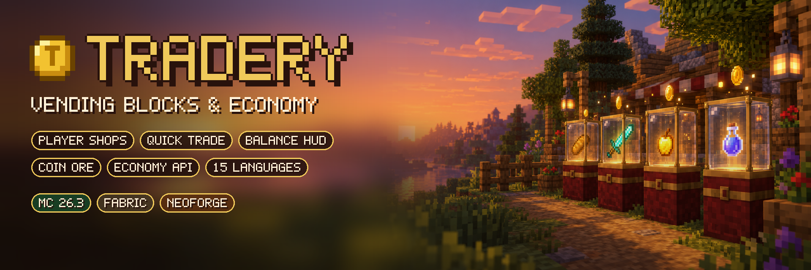
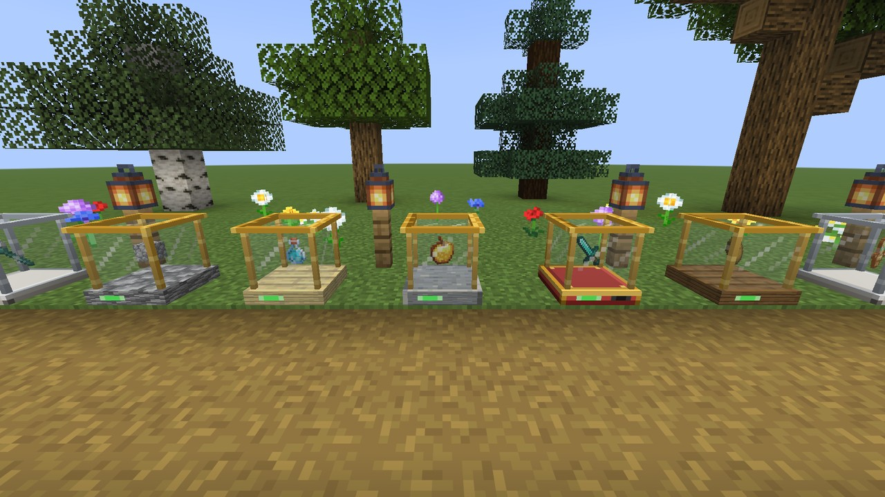
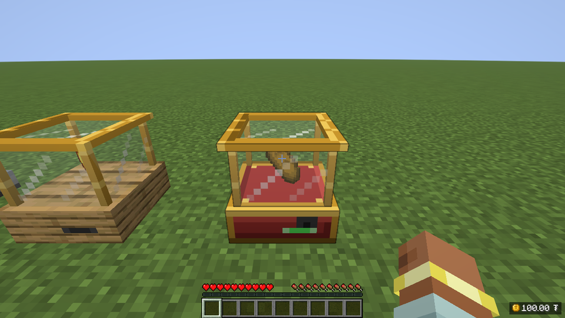
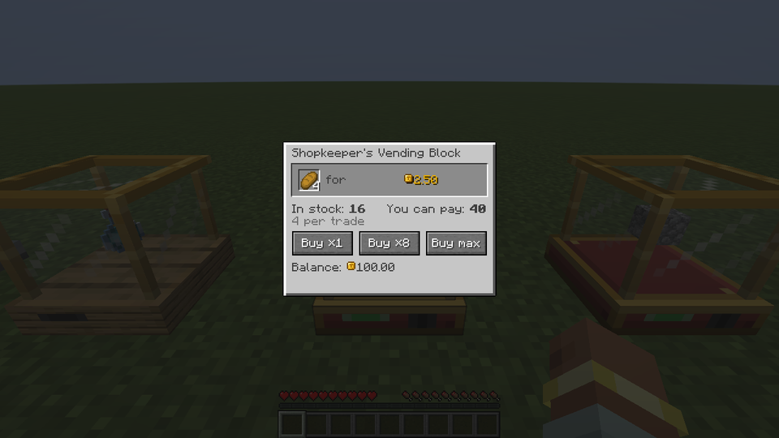
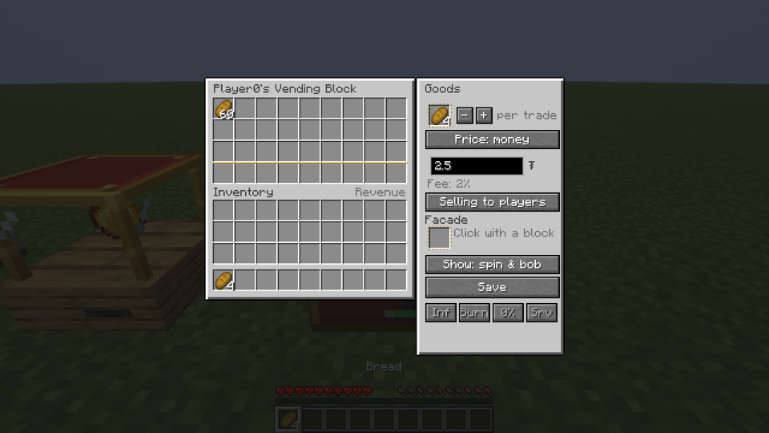
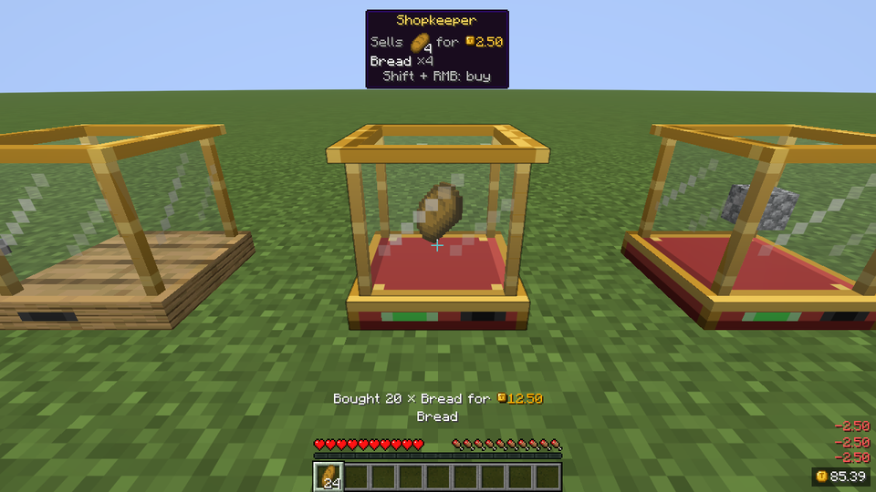
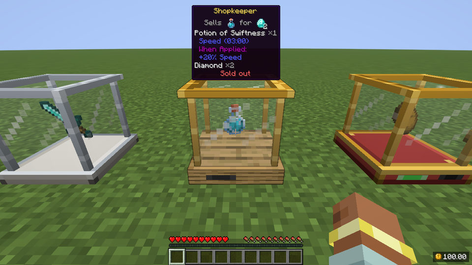
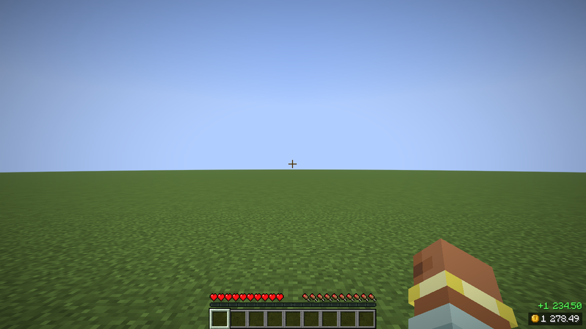
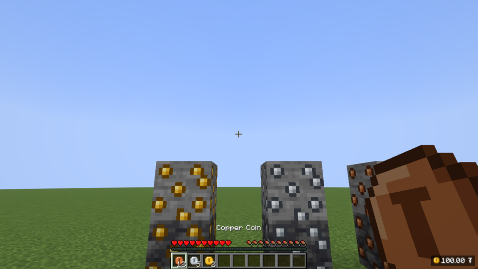

<div align="center">



# Tradery — Vending Blocks & Economy

[](https://www.minecraft.net/)
[](https://fabricmc.net/)
[](https://files.minecraftforge.net/)
[](https://adoptium.net/)
[](LICENSE)
[](docs/api/README.md)

**Player shops in a block, a currency you can see on screen, and coin ore as the source of money — for Fabric and Forge, with a public Economy API.**

[Vending](#vending-blocks) • [Balance HUD](#balance-hud) • [Money](#where-money-comes-from) • [Commands](#commands) • [Servers](#for-servers) • [Developers](#for-developers) • [Compatibility](#compatibility)

</div>

---

Tradery is a spiritual successor to the classic **Vending Block** mod: put a block down, stock it, set a price and let people buy while you're away. Prices are paid in **items** (the classic way) or in the server's **currency**, which every player sees in the corner of the screen.

**Languages:** English, Русский, Українська, Беларуская, Polski, Deutsch, Nederlands, Svenska, Français, Español, Português (Brasil), 日本語, 简体中文, 繁體中文 (台灣), 繁體中文 (香港)



## Vending blocks



- **One block, one offer:** "4 bread for 2.50 ₮" or "1 golden apple for 2 diamonds". Up to 64 items per trade, 27 slots of stock.
- **Money or items:** money goes straight to the owner's balance (minus a configurable fee); items land in 9 revenue slots.
- **Buyback:** flip one switch and the block *buys* the goods from players with the owner's money — a market for your miners.
- **Quick trade, no window:** sneak + right-click buys one lot, sneak + left-click sells one to a buying block; hold the button to keep trading (about 5 lots a second). A plain right-click opens the window with ×1 / ×8 / ×max.
- **Look-at hint:** owner, goods and price with icons, the trade keys, or why it can't trade right now (sold out, not set up). Sneak to see the items' full tooltips. Off by default when Jade is installed, which shows the same.
- **Sells while you're offline**; you get "Sold 16 × Bread for 40 ₮ (Steve)" when online and a summary when you join.
- **Facades:** use any full block as the base. **Showcase animations:** static, spin, bob, spin & bob, or hidden.
- **Display block:** a glass case that shows an item and sells nothing.
- **Admin vendors** (vendor key): infinite stock, payment burned as a money sink, no fee, owned by the server.
- **Safe by design:** only the owner can break it (explosions, pistons and hoppers can't touch it), the buyer screen has no item slots to exploit, and every sale checks stock, money and room *before* anything moves. Each case is covered by automated tests.

| Buyer | Owner |
|---|---|
|  |  |

| Quick trade (sneak + hold right-click) | Look-at hint while sneaking |
|---|---|
|  |  |

## Balance HUD



Your balance in any corner, with a coin icon, a rolling counter and `+120` / `-40` popups. Scale 0.5–2, full (`1 250.00`) or short (`1.2K`) format, hidden with F1 or a key (unbound by default) or `/tradery hud`. It moves above the hotbar on small screens.

## Where money comes from



- **Coin ore** in three tiers (copper, silver, gold), in stone and deepslate. Mining it puts the coins' value **straight on your balance**; machines and explosions drop coin items instead. Fortune doesn't multiply money, and coin ore is not an `c:ores` ore, so crushers can't double it. Vein count, size and height are a data pack away.
- **Coins** are cash: right-click to deposit, `/tradery withdraw` to pay out, trade them in item-priced vending blocks.
- **Rewards** for killing mobs (on by default), and optionally for mining, crafting, fishing and advancements. Spawner mobs pay nothing, there are diminishing returns and a daily cap.
- **Money sinks:** vending fee, `/pay` tax, burning admin vendors. `/eco stats` shows money created and destroyed per day, to tune it all.

## Commands

| Command | What it does | Permission | Default |
|---|---|---|---|
| `/bal [player]` (`/balance`) | Your or someone's balance | `tradery.balance`, `tradery.balance.others` | everyone / op 2 |
| `/pay <player> <amount>` | Pay a player (online or offline) | `tradery.pay` | everyone |
| `/baltop [page]` | Richest players | `tradery.baltop` | everyone |
| `/tradery history [page]` | Your last transactions | `tradery.history` | everyone |
| `/tradery withdraw <amount>` | Balance → coins | `tradery.withdraw` | everyone |
| `/tradery hud` | Show/hide the balance HUD | — | everyone |
| `/eco give\|take\|set <player> <amount>` | Change a balance | `tradery.admin.eco` | op 2 |
| `/eco lock\|unlock <player>` | Freeze an account | `tradery.admin.eco` | op 2 |
| `/eco stats` | Money supply, created/destroyed today and this week | `tradery.admin.stats` | op 2 |
| `/tradery vendors [player]` | Vending blocks with clickable coordinates | `tradery.admin.vendors` | op 2 |
| `/tradery reload` | Reload the configs | `tradery.admin.reload` | op 3 |

Amounts are typed in normal units (`/pay Steve 12.50`). Permissions work with LuckPerms or any permission mod (fabric-permissions-api / Forge PermissionAPI).

## For servers

Configs are JSON5 files with comments in `config/tradery/`:

- **`server.json5`** — currency (name, symbol, decimals, separator), starting balance, balance ceiling, `/pay` tax, vending fee and per-player limit, item and facade blacklists, coin ore on/off, direct-to-balance, coin values, daily cap, inflation damping, log retention.
- **`rewards.json5`** — rewards per mob / block / item / advancement (ids, `#tags` or `*`), spawner and fake-player rules, daily cap, diminishing returns.
- **`client.json5`** — each player's HUD and notification settings.

Broken values fall back to their defaults and are reported in the log; unknown keys are reported too. Apply changes with `/tradery reload`.

Every transaction is written to `<world>/tradery/logs/YYYY-MM-DD.log` (JSON lines). Balances are saved with the world. When Minecraft writes a vending block's chunk, the money and the traders' inventories are written in the same tick, so after a crash the stock, the money and the items always match: nothing duplicated, nothing lost (checked with a real `kill -9`, `tools/crash-test.sh`).

## For developers

`dev.eliasnvx:tradery-api:1.0.0+1.20.1` — accounts, atomic transactions and events, one API for Fabric and Forge. See the **[API guide](docs/api/README.md)**.

```java
TraderyEconomy eco = TraderyEconomy.get();               // server thread only
Account account = eco.account(player.getUUID());
TransactionResult result = eco.withdraw(account, 500,    // 5.00 with 2 decimals
    Reason.of(new ResourceLocation("mymod", "teleport_fee")));

// 5% tax on every vending sale inside a region
VendingPurchaseEvent.Pre.EVENT.register(e -> {
    if (Regions.at(e.pos()).is("market")) e.setPrice(e.price() * 105 / 100);
});
```

On Fabric, Tradery is also a **Common Economy API** provider, so mods like Universal Shops work with Tradery balances out of the box.

## Compatibility

| Mod | What you get |
|---|---|
| Jade | Owner, offer and stock when you look at a vending block |
| JEI / REI | Drag items into the goods, price and facade slots; info pages for the blocks, coin ore and coins |
| Common Economy API (Fabric, included) | Other economy mods read and change Tradery balances |
| Text Placeholder API (Fabric) | `%tradery:balance%`, `%tradery:balance_short%`, `%tradery:top_name 1%`, `%tradery:top_balance 1%`, `%tradery:currency%` |
| LuckPerms | All `tradery.*` permission nodes |

All of them are optional. EMI and WTHIT support is planned.

## Versions

One branch per Minecraft version, the same features everywhere:

| Minecraft | Loaders | Branch |
|---|---|---|
| 26.3 | Fabric, NeoForge | [`26.3-dev`](https://github.com/eliasnvx/Tradery/tree/26.3-dev) |
| 1.21.1 | Fabric, NeoForge | [`1.21.1-dev`](https://github.com/eliasnvx/Tradery/tree/1.21.1-dev) |
| 1.20.1 | Fabric, Forge | [`1.20.1-dev`](https://github.com/eliasnvx/Tradery/tree/1.20.1-dev) (this one) |

## Building

```bash
./gradlew build                      # both loaders, JUnit and GameTests
./gradlew :fabric:runClient
./gradlew :forge:runClient
./gradlew :fabric:runClient -Pcompat=true   # with JEI, REI, Jade, Placeholder API
./gradlew :fabric:runClientTest      # client checks with screenshots (Fabric)
./gradlew :forge:runClientTest       # client checks with screenshots (Forge)
tools/crash-test.sh                  # kill -9 a dedicated server mid-play, check the rollback
```

Requires JDK 17 for the mod and JDK 25 for Gradle itself (`gradle/gradle-daemon-jvm.properties`). Textures and models are generated by `tools/textures.py` and `tools/assets.py`. The mod page images (banner, section headers, gallery) come from `tools/docs/make_page_images.py`; see [`docs/pages/README.md`](docs/pages/README.md).

## License

MIT. Tradery is written from scratch; no code from other Vending Block ports is used.
